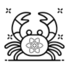

# NoApi

A Rust fullstack web framework [Axum + React], with the concept of Rust server actions, utilizes the type safety of Rust and TypeScript to make calls to server without APIs.

## Get Started

Install the CLI tool

```bash
  cargo install noapi
```

Start a new project

```bash
  noapi new <PROJECT_NAME>
```

Install dependencies

```bash
  noapi install
```

Start the server

```bash
  noapi runserver
```

## Tech Stack

**Client:** React, TypeScript, TailwindCSS

**Server:** Axum

## Documentation

[Documentation](https://docs.rs/noapi-functions)

## Demo

Demo video coming soon!!!

## License

[MIT](https://choosealicense.com/licenses/mit/)
